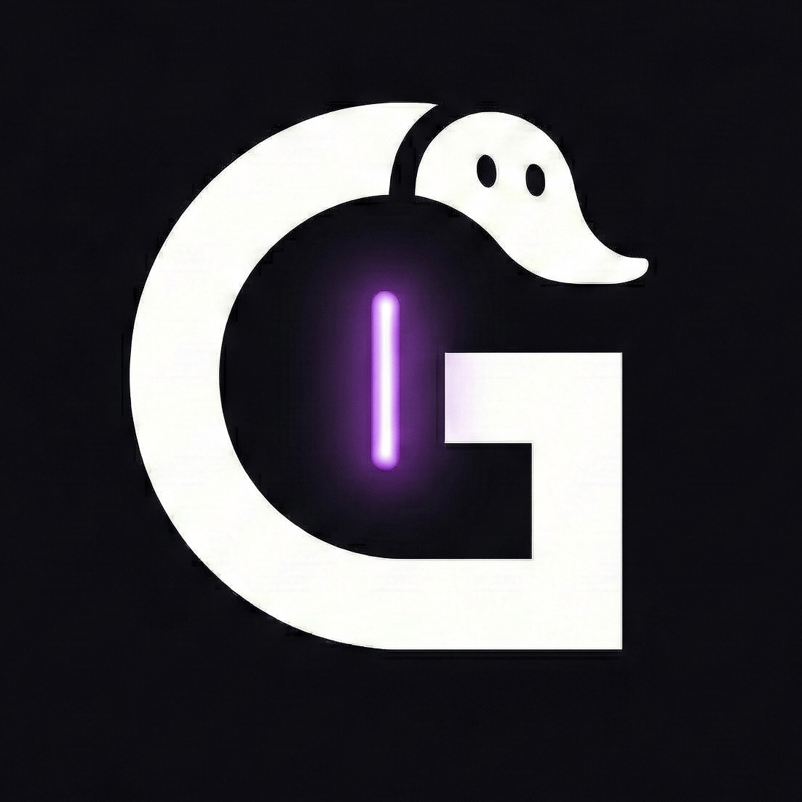
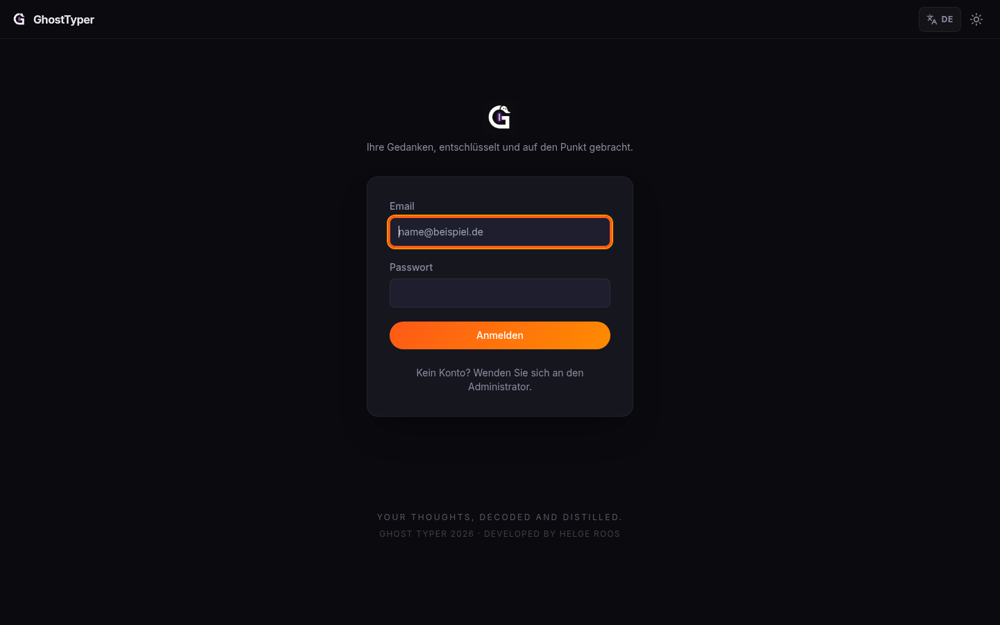

<div align="center">
  
  <h1>GhostTyper</h1>
  <p><strong>Self-hosted transcription, OCR and AI analysis platform.</strong></p>
  <p>
    <a href="#quickstart">Quickstart</a> ·
    <a href="#features">Features</a> ·
    <a href="#architecture">Architecture</a> ·
    <a href="docs/README.md">Documentation</a> ·
    <a href="CHANGELOG.md">Changelog</a>
  </p>
  <p>
    <strong>English</strong> · <a href="README.de.md">Deutsch</a>
  </p>

  <p>
    
    
    
    
    
    
  </p>
</div>

<p align="center">
  
</p>

GhostTyper bundles audio transcription, OCR, AI summaries, structured data
extraction and live meeting capture into a single self-hosted application.
Multiple workspaces, role-based permissions, encrypted API keys and a full
audit trail are part of the baseline.

<details>
<summary>More screenshots</summary>

Currently available: `docs/screenshots/01-login.png`. Dashboard and
remote-meeting screenshots are TODO / need capture before they are embedded.

</details>

---

## Features

- **Audio transcription** with speaker diarisation; direct browser recording
  or file upload. Large recordings are automatically compressed and split into
  overlapping chunks, so files of any length transcribe reliably despite the
  provider's per-file size limit.
- **Remote-meeting bot** for Google Meet, Microsoft Teams and Zoom via
  [Vexa Lite](https://github.com/Vexa-ai/vexa) — live transcript flows
  into the same editor. A community fork
  ([helge7925/vexa](https://github.com/helge7925/vexa), branch
  `feat/nextcloud-talk-adapter`) adds Nextcloud Talk as a fourth
  platform; swap the image via `VEXA_LITE_IMAGE` to enable.
- **OCR** for PDFs and images.
- **AI analysis**: summaries, meeting minutes, action-item / to-do extraction,
  free-form prompts, custom templates and translation.
- **AI chat over your content**: attach documents and knowledge bases as
  context — or drop / paste / upload a file straight into the chat — and ask
  questions; conversations are titled automatically.
- **Workspace knowledge bases**: group documents for retrieval-augmented chat.
- **Data tables**: structured extraction from audio, text or documents;
  Excel export.
- **Nextcloud export**: save transcripts and analyses to a Nextcloud folder
  over WebDAV, configured per workspace with an app password.
- **Multi-workspace**: org-scoped data, roles `owner`/`admin`/`member`/
  `viewer`/`auditor`, audit log.
- **Cost tracking**: monthly breakdown per provider, operation and member.
- **Provider management**: Mistral, Vexa and Nextcloud managed centrally per
  workspace; secrets encrypted with AES-256-GCM.

## Tech Stack

| Layer    | Technology                                                       |
| -------- | ---------------------------------------------------------------- |
| Frontend | Next.js 16.x (Pages Router), React 18, Tailwind, Radix, Zustand |
| Backend  | Next.js API Routes, NextAuth, PostgreSQL 16 (`pg`)               |
| AI       | Mistral (Chat / OCR / Voxtral batch + live), Vexa Lite           |
| Infra    | Docker Compose, Traefik (optional), AES-256-GCM (`lib/secrets.js`) |
| CI       | GitHub Actions: CodeQL, security gates, smoke tests              |

## Architecture

```
┌─────────────────────────┐    ┌──────────────────────────┐
│ GhostTyper webapp       │    │ Postgres 16              │
│ Next.js 15.5.x + worker │◄──►│ workspaces · audit · logs│
└──┬──────────────┬───────┘    └──────────────────────────┘
   │              │
   │ REST/SSE     │ webhook + bridge
   ▼              ▼
┌────────┐   ┌──────────────────┐    ┌────────────────────┐
│ Mistral│◄──┤ Vexa Lite        │───►│ Mistral Voxtral    │
│ API    │   │ (bot container)  │    │ (via voxtral       │
│ (batch)│   │                  │    │  translator bridge)│
└────────┘   └──────────────────┘    └────────────────────┘
```

Detailed flow: [`docs/architecture.md`](docs/architecture.md). Vexa
integration: [`docs/vexa-integration.md`](docs/vexa-integration.md).

## System Requirements

| Profile               | RAM   | CPU      | Disk    | Notes                                |
| --------------------- | ----- | -------- | ------- | ------------------------------------ |
| Minimum (without Vexa) | 2 GB  | 1 vCPU   | 10 GB   | webapp + Postgres only               |
| With `vexa` profile   | 4 GB  | 2 vCPU   | 20 GB   | adds vexa-lite (2 GB) + bridge (256 MB) |
| 5–10 active users     | 8 GB  | 4 vCPU   | 40 GB SSD | comfortable for daily team usage   |

Speech-to-text inference runs at Mistral (Voxtral) for both batch
uploads and the live/Vexa path, so **no GPU is required on the host**.
Browser bots inside Vexa add roughly 1 GB transient RAM per concurrent
live meeting. The `vexa-lite` image is `linux/amd64`-only —
on Apple Silicon it runs under emulation and is noticeably slower.

## Quickstart

Prerequisites: Docker + Docker Compose v2, a Mistral API key.

```bash
git clone https://github.com/helge7925/transkription_webapp.git
cd transkription_webapp
cp .env.example .env
# Generate secrets in .env with `openssl rand -hex 32`,
# set DB_USER / DB_PASSWORD / DB_NAME / DOMAIN.

docker compose -f config/docker-compose.prod.yml --env-file .env up -d --build
```

Initialise the schema (one time):

```bash
docker compose -f config/docker-compose.prod.yml --env-file .env \
  exec transkription-webapp \
  wget -qO- --post-data='' \
  --header "X-Init-Secret: $(grep ^DB_INIT_SECRET .env | cut -d= -f2)" \
  http://127.0.0.1:3000/api/db-init
```

Seed an admin:

```bash
npm run seed-admin
```

The app is then reachable at `http://localhost:3000` (or behind Traefik
on `https://${DOMAIN}`).

### With remote-meeting bot

Vexa Lite + the transcription bridge are wired up as an optional Compose
profile. Default audio path is **Mistral Voxtral (Paris, EU)** so the
biometric meeting audio (GDPR Art. 9) does not leave the EU. The bridge
service is `voxtral-bridge` (it proxies to Mistral Voxtral; the legacy
`FIREWORKS_API_KEY` env var is still honoured as a fallback) — see
"GDPR-conformant setup" below.

```bash
COMPOSE_PROFILES=vexa
# EU default — recommended
VEXA_TRANSCRIPTION_URL=https://api.mistral.ai/v1/audio/transcriptions
VEXA_TRANSCRIPTION_TOKEN=$MISTRAL_API_KEY
VEXA_ADMIN_API_TOKEN=$(openssl rand -hex 32)
BRIDGE_SHARED_SECRET=$(openssl rand -hex 32)
```

Then bring it up with `--profile vexa`. Operator guide:
[`docs/vexa-integration.md`](docs/vexa-integration.md). For the full
data-flow review and SCC/TIA implications when switching providers, see
[`docs/gdpr-setup.md`](docs/gdpr-setup.md).

## Configuration

Per workspace, an admin manages everything under
**Settings → Workspace verwalten**:

- API keys & integrations (Mistral, Vexa)
- Members & roles (incl. per-member spend caps)
- Retention windows
- Usage & cost dashboard
- Audit log

Full ENV reference: [`.env.example`](.env.example).

## Tests & quality

| Command                  | Purpose                                              |
| ------------------------ | ---------------------------------------------------- |
| `npm test`               | 139 unit tests (table logic, Vexa mapper, webhooks, sentence buffer, permissions, secrets, …) |
| `npm run lint`           | ESLint with the Next.js rule set                     |
| `npm run smoke`          | Docker / API smoke test                              |
| `npm run smoke:full`     | Smoke + tests + lint + build + PDF renderer         |
| `npm run retention:apply`| Apply the retention policy                           |

CI pipelines: CodeQL (security), security gates (secrets scan), smoke
(`/api/health` + build). See [`.github/workflows`](.github/workflows).

## Documentation

- [`docs/README.md`](docs/README.md) — index of all documents
- [`docs/architecture.md`](docs/architecture.md) — data flow + components
- [`docs/vexa-integration.md`](docs/vexa-integration.md) — operator guide
  for remote-meeting capture
- [`docs/api-specification.md`](docs/api-specification.md) — REST API reference
- [`docs/vps-deployment-guide.md`](docs/vps-deployment-guide.md) — production
  deployment
- [`docs/cybersecurity-audit-2026-02-21.md`](docs/cybersecurity-audit-2026-02-21.md)
  — most recent security audit

## Contributing

Issues and pull requests are welcome — see [`SECURITY.md`](SECURITY.md)
for security disclosures and the templates under
[`.github/`](.github/) for structured submissions.

## License

[PolyForm Noncommercial License 1.0.0](LICENSE). Permits private,
academic, non-profit and hobby use, plus modification and redistribution,
as long as the use is non-commercial. Commercial use — including
internal use in a for-profit organisation — requires a separate license;
please open a discussion in the issue tracker or contact the copyright
holder directly.
