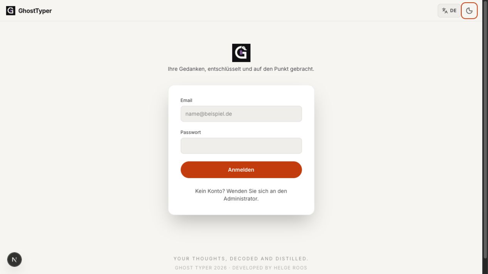
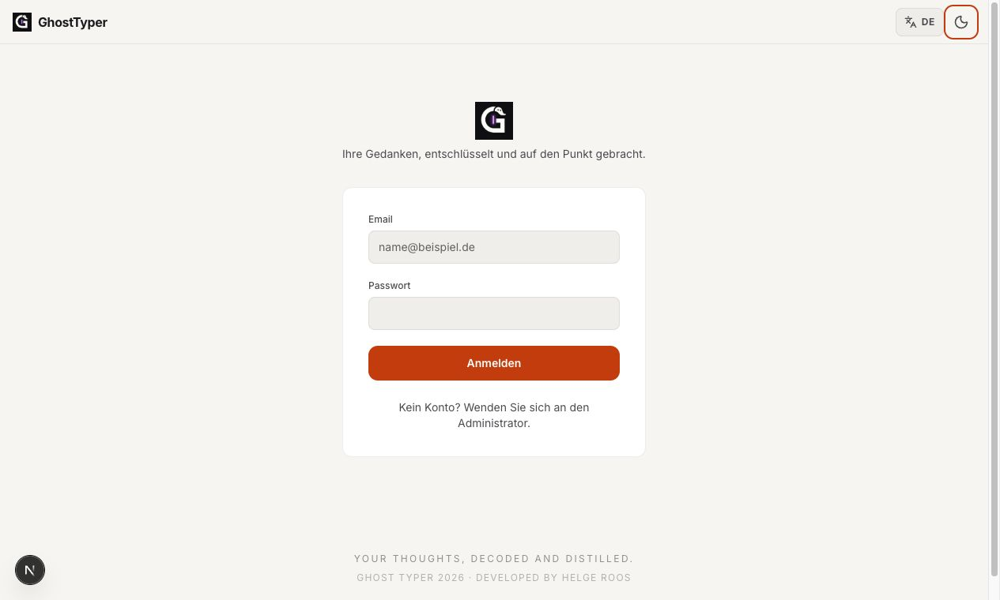
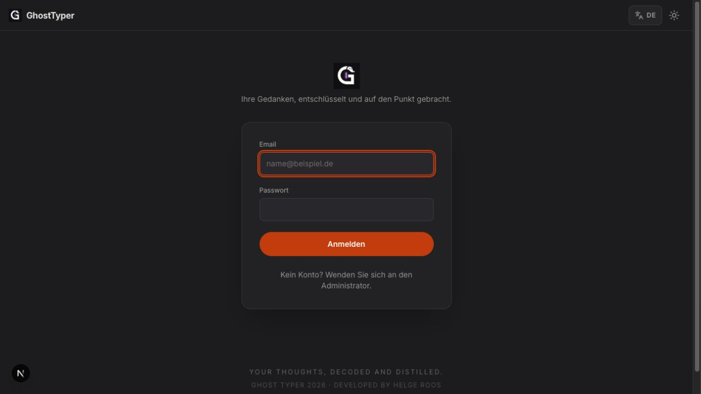
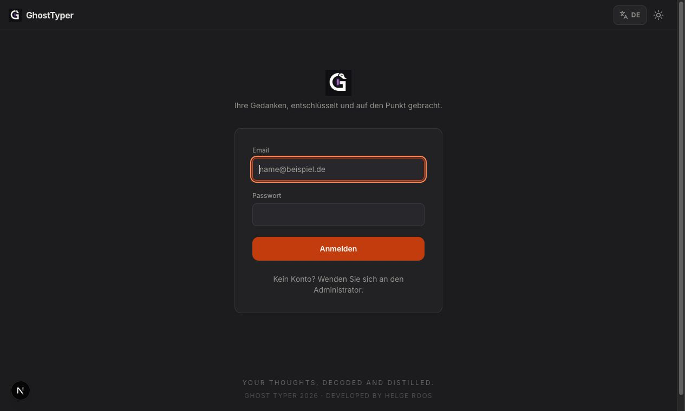
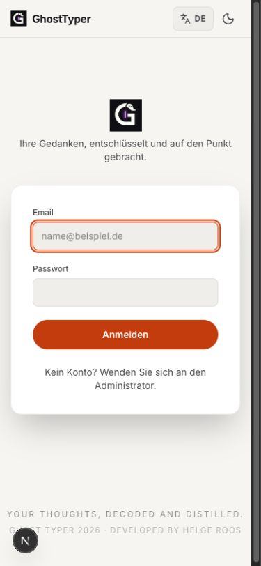
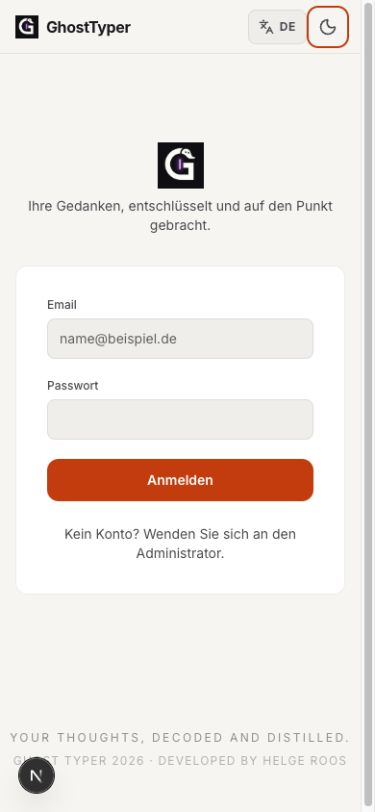

# UI Sprezzatura — Phase 3 audit

Date: 2026-07-25

## Outcome

Phase 3 closes the cross-application dark-theme and accessibility pass.
The audit covered the semantic color system, global keyboard behavior,
shared controls, all Phase-2 screens, public/authentication screens, profile,
administration, organization settings, sharing surfaces and supporting panels.

## Changes

- Added an AA-safe `accent-ink` token for orange text. The unchanged brand
  orange remains available for non-text UI graphics; filled controls use
  `accent-strong`.
- Raised muted and semantic status colors to at least 4.5:1 against canvas,
  surface and elevated surface in both themes.
- Gave the dark theme its own high-contrast focus-ring color.
- Added native `color-scheme`, theme-aware selection colors and reduced-motion
  behavior.
- Extended the global focus treatment to `summary` and editable document
  surfaces.
- Added a localized skip link and stable main-content target to the shell.
- Added accessible status semantics to the global loading indicator.
- Removed raw accent text and raw accent/white control combinations throughout
  `pages/` and `components/`.
- Marked decorative inline SVGs as hidden from the accessibility tree.
- Made the profile image picker keyboard-accessible and migrated the remaining
  profile/authentication controls to shared `Button`, `Card` and `Field`
  primitives.

## Automated gates

`tests/ui-accessibility.test.mjs` protects the following invariants:

- every text token is at least 4.5:1 on all three surfaces in both themes;
- every focus-ring/surface pair is at least 3:1;
- the application shell retains its skip link and named loading status;
- raw accent text and raw accent/white controls cannot be reintroduced.

Lowest measured text ratios:

| Theme | Pair | Ratio |
| --- | --- | ---: |
| Light | muted / elevated surface | 4.60:1 |
| Light | info / elevated surface | 4.70:1 |
| Dark | danger / elevated surface | 5.29:1 |
| Dark | muted / elevated surface | 5.45:1 |

The detailed executable table remains in `docs/ui/contrast-check.mjs`.

## Browser verification

The public shell was checked at desktop and 390 × 844:

- light and dark themes;
- no unnamed visible interactive controls;
- one main landmark and one level-one heading;
- no horizontal overflow;
- no computed text contrast failures;
- `/`, `/login` and `/register` verified.

Authenticated Phase-2 routes were audited at source/component level because
the local browser run had no seeded authenticated test session. Their shared
tokens, focus rules and primitives are covered by the automated gates above.

## Before / after gallery

The “before” images were rendered from the clean Git `HEAD` baseline; the
“after” images are the Phase-3 working tree.

### Desktop — light

| Before | After |
| --- | --- |
|  |  |

### Desktop — dark

| Before | After |
| --- | --- |
|  |  |

### Mobile — light

| Before | After |
| --- | --- |
|  |  |

The after state removes decorative depth and pill CTAs, preserves one clear
primary action, adds a visible AA focus treatment, and keeps the mobile form
within the viewport.
